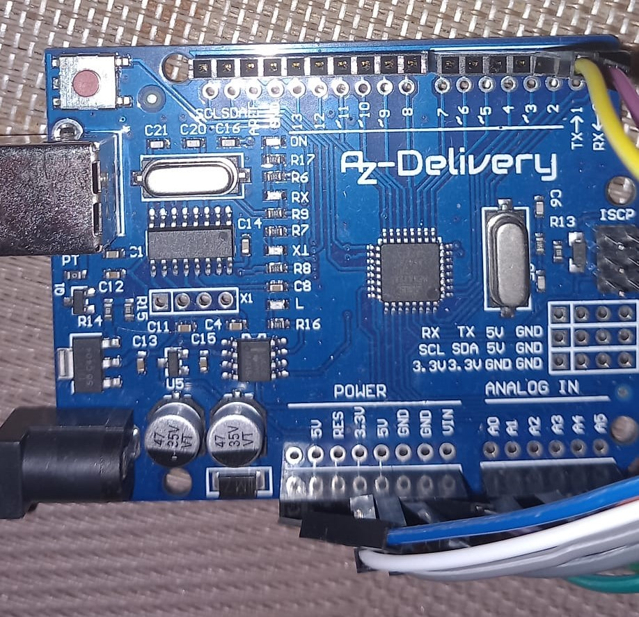

# FDP
This repository contains the codes for VBScript, Arduino &amp; Python used to compose the FDP.

## Hardware

### Arduino Uno

### Raspberry pi 3

### C12880MA

## Software

### OptiFDTD

### Arduino

### Python

